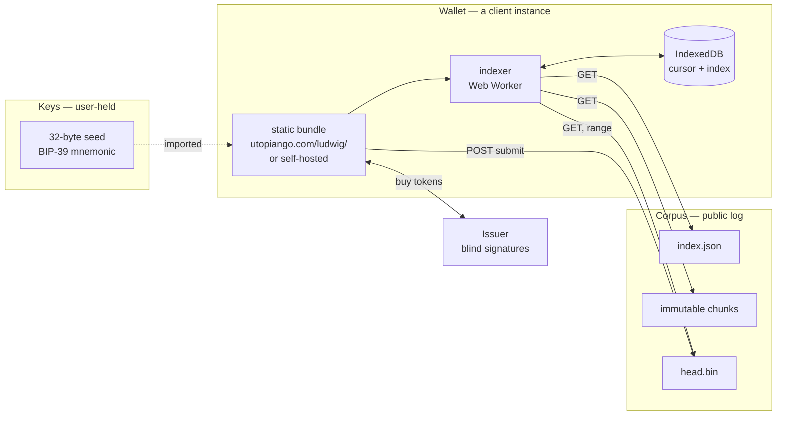
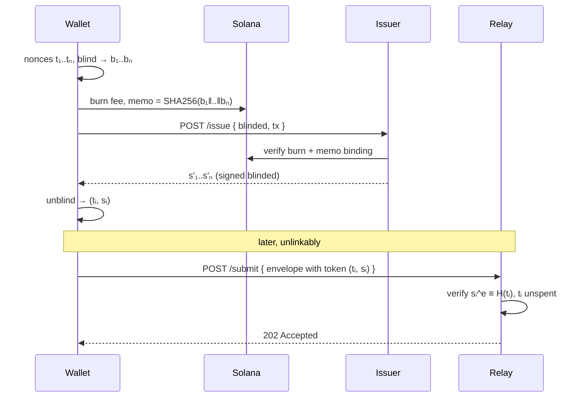
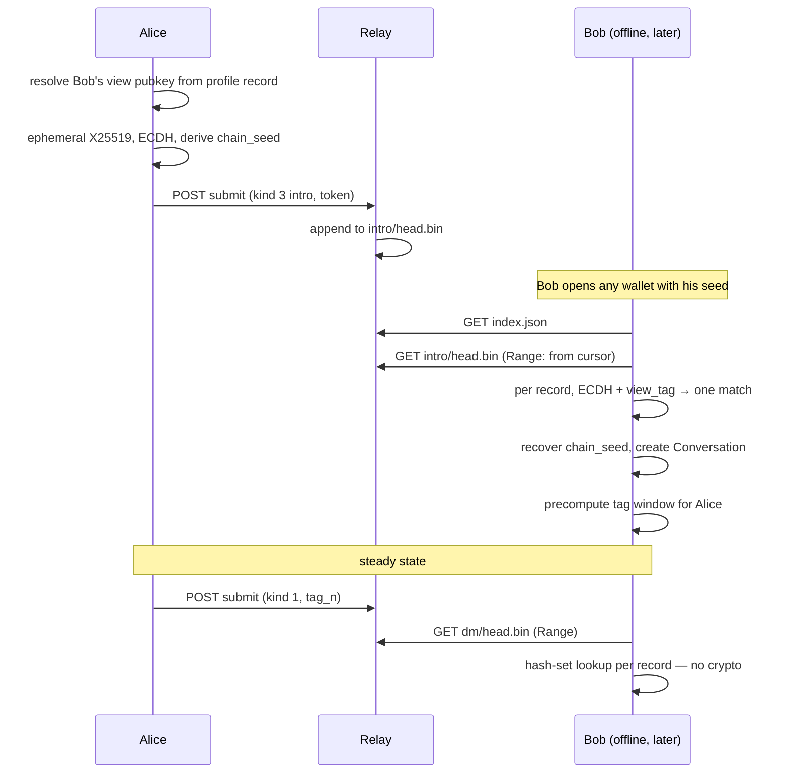

# Corpus — a self-custodial messaging protocol

**Status:** Draft
**Author:** Ludwig Schubert
**Created:** 2026-08-07
**Updated:** 2026-08-07

## Summary

Corpus is an HTTP-based messaging protocol for public topic threads, private direct
messages, and notifications. Messages live in a public, append-only, immutable log that
anyone can mirror over plain HTTP. Recipients find their own messages by scanning that log
locally with keys they own and can export — no server ever learns who a message is for.
Keys are rooted in a user-held seed, not a wallet, so a message encrypted today is readable
in ten years by anyone still holding the seed.

## Motivation

UtopianGo shows an info panel for a topic and a token card for a mint. Both are places
people want to talk, and neither has anywhere to do it. The Discussions tab already renders
Brave's forum results, so the surface exists and arrives pre-seeded — a thread there is
never empty on day one.

The cost of building this the ordinary way is that UtopianGo becomes the owner of everyone's
social graph: a database keyed by user, queryable by us, subpoenable from us, and gone if we
are. That is the opposite of what the app is for. Corpus is the version where we host a
cache rather than an authority, where the client does the private work, and where a user can
walk to a different client — or their own — without asking permission or losing history.

Three properties drive every decision below, in this order:

1. **Self-custody.** Keys are exportable. Losing the app never loses the messages.
2. **Recipient privacy.** The network learns content *and* recipient of nothing.
3. **Durability.** Ciphertext plus seed is sufficient to read, forever, with no live service.

## Design

### Architecture

Three modules that know almost nothing about each other. This separation is the protocol's
main idea: each can be swapped without touching the others.



A **wallet** is a client, not a server — closer to MetaMask than to a mailbox. It serves
code, never your data. `utopiango.com/ludwig/` and `utopiango.com/ludwig2/` are two
deployments of the same bundle; pointing both at the same seed gives you the same inbox,
because each independently re-derives it from the public corpus. Self-hosting and
multi-tenant hosting differ only in who serves the JavaScript.

The **corpus** is dumb on purpose. It accepts well-formed records with a valid write token,
appends them, and serves bytes. It cannot filter by recipient, because no record says who it
is for.

### Key hierarchy

The root is a 32-byte seed the user can export as a 24-word BIP-39 mnemonic. It is **not**
derived from and not recoverable from a Solana wallet. A wallet signature may *generate* the
seed during onboarding, but the mnemonic is displayed at that moment and is thereafter the
only root that matters — otherwise losing the wallet loses ten years of messages.

```
seed (32 bytes)
├── HKDF-SHA256(seed, info="utopia/v1/identity") → Ed25519 keypair   — who you are
├── HKDF-SHA256(seed, info="utopia/v1/view")     → X25519 keypair    — what you can read
└── HKDF-SHA256(seed, info="utopia/v1/spend")    → Ed25519 keypair   — buys write tokens
```

Splitting **view** from **identity** is what makes read-only clients possible. Handing a new
client the X25519 view secret alone lets it index and decrypt your inbound history while
being unable to post as you or spend your tokens. That is the intended shape of "connect
`/ludwig2/` and let it start indexing."

Your **handle** is the base58 Ed25519 identity public key (44 chars). Correspondents also
need your X25519 view public key; they resolve it from a signed `profile` record in the
corpus, so the thing you paste into a chat stays short. For out-of-band first contact where
no profile has been published, a self-contained bundle is defined:

```
utopia1<bech32m(version || ed25519_identity_pub || x25519_view_pub)>
```

Optionally, a signed `link` record binds a Solana address to a Corpus identity. Public
threads may use it for cost-based ranking (below). Direct messages never reference it.

### Corpus layout

An append-only log, split into **streams**, each a series of immutable chunks plus one open
head. Streams are separated only along axes that are already public, so sharding leaks
nothing that the envelope did not already reveal.

```
GET /corpus/v1/index.json

{
  "version": 1,
  "issuers": ["<base64 RSA-2048 SPKI>", "..."],   // write-token keys this relay accepts
  "streams": {
    "dm":    { "head": "dm/head.bin",    "chunks": [...] },
    "intro": { "head": "intro/head.bin", "chunks": [...] },
    "t/9f2a": { "head": "t/9f2a/head.bin", "chunks": [...] }   // topic shard, by tag prefix
  }
}
```

Each chunk entry is `{ "id": "2026-08-07T14", "url": "...", "sha256": "...", "bytes": 184320, "count": 1204 }`.

Sealed chunks never change and are served `Cache-Control: public, max-age=31536000, immutable`.
The open head is append-only and served `no-cache` with `Accept-Ranges: bytes`, so a client
resumes with `Range: bytes=<cursor>-` and receives exactly the records it has not seen. That
is the entire sync algorithm: **HTTP range requests against an append-only file.** Mirroring
is `wget -r`. Archiving for ten years is keeping the directory.

Records are length-prefixed within a chunk:

```
record := u32 byte_length || envelope
```

### Envelope

One envelope for every message class. The addressing mode is what differs, and it is carried
in a single 16-byte `tag` that means different things per kind — topic hash when public,
rotating detection tag when private. Unifying here and *only* here is deliberate: public
threads and private messages want opposite properties everywhere else.

```
envelope :=
  u8    version         // 1
  u8    kind            // 0=post  1=direct  2=notification  3=intro
  u64   timestamp_ms    // relay-stamped, advisory only — never trusted for ordering
  [16]  tag             // see per-kind meaning below
  u16   token_len || token      // blind-signed write token
  u32   payload_len || payload
```

| kind | tag is | payload | author visible |
|---|---|---|---|
| 0 `post` | `SHA256(topic_key)[0..16]` | plaintext | yes, signed in the clear |
| 1 `direct` | rotating chain tag | sealed-sender ciphertext | no |
| 2 `notify` | `SHA256(topic_key)[0..16]` | plaintext, publisher-signed | yes |
| 3 `intro` | random 16 bytes | ephemeral-DH ciphertext | no |

**Public payload** (kinds 0 and 2) — text only, threading by parent hash:

```
payload :=
  [32]  author_ed25519_pub
  u16   topic_len || topic        // canonical topic key, verified against tag
  [32]  parent_id                 // SHA256 of parent envelope, or 32 zero bytes
  u32   body_len || body          // UTF-8
  [64]  signature                 // Ed25519 over all preceding bytes
```

**Direct payload** (kind 1) — sealed sender: the author is inside the ciphertext, so the
network sees an unattributed blob:

```
payload :=
  [12]  nonce
  [..]  AES-256-GCM ciphertext of:
          [32] author_ed25519_pub
          [32] parent_id
          u32  body_len || body
          [64] signature          // Ed25519 over the inner plaintext
```

**Intro payload** (kind 3) — first contact, before a shared chain exists:

```
payload :=
  [32]  ephemeral_x25519_pub
  [1]   view_tag                  // first byte of the derived secret
  [12]  nonce
  [..]  AES-256-GCM ciphertext of:
          [32] author_ed25519_pub
          [32] author_x25519_view_pub
          [32] chain_seed         // seeds the conversation's tag chain
          u32  body_len || body
          [64] signature
```

Bodies are padded to fixed buckets (256 / 1024 / 4096 / 16384 bytes) before encryption.
Ciphertext length otherwise leaks a rough content fingerprint, which is exactly the metadata
this design is spending bandwidth to hide.

### Detection: why scanning is fast

Naive trial decryption costs one X25519 ECDH per candidate message. Through WebCrypto's
async boundary that is far worse than the raw curve arithmetic suggests, and it is the reason
this class of protocol is usually slow. Corpus splits detection into a fast path and a rare
slow path.

**Established conversations (kind 1) — O(1), no crypto in the scan loop.** After an intro,
both sides hold a `chain_key`. Message *n* is tagged:

```
tag_n = HMAC-SHA256(chain_key, "utopia/v1/tag" || u32(n))[0..16]
```

The client precomputes a window of upcoming tags for every conversation into a hash set, so
scanning is one hash-set lookup per record. Tags are indistinguishable from random to anyone
without `chain_key`, so they are unlinkable to observers, and they are fully deterministic,
so a client restoring from seed ten years later recomputes the identical sequence. The
window is the HD-wallet gap-limit problem: pick 256, extend on a hit.

**First contact (kind 3) — genuine trial decryption, but over a tiny stream.** This is why
intros get their own stream. Introductions are rare and cost a write token, so the intro
stream is a small fraction of corpus volume, and the expensive O(n) ECDH pass runs only over
that. The 1-byte `view_tag` rejects 255/256 of candidates before the AEAD, though it cannot
avoid the ECDH itself.

The result: per record in the main DM stream, one hash lookup. Per record in the intro
stream, one ECDH. That difference is the whole reason this is usable.

### Write tokens

Sealed sender means the relay cannot charge, rate-limit, or ban an author — it does not know
who they are. Spam resistance instead comes from an unforgeable, unlinkable **write token**
that must be attached to every record.

Tokens use blind RSA signatures (RFC 9474 RSABSSA). Blinding and unblinding are modular
exponentiation and modular inverse over native `BigInt`, so the client cost is a few dozen
lines and no library.



The issuer learns that an address bought *n* tokens. The relay learns that *a* valid token
was spent. Neither can link the two, and they may be different operators — the relay's
`index.json` lists the issuer keys it honours, so issuers are pluggable and a relay can
accept several. The issuer is semi-trusted in one direction only: it can refuse service or
over-issue, inflating spam, but it can never deanonymize.

Two caveats worth stating: unlinkability holds only within an epoch's anonymity set, so
issuer keys rotate per epoch and clients should spread spending across epochs rather than
buying and dumping *n* tokens in one burst.

### Ranking, not moderation

Nothing in the protocol removes a record. Relays store everything well-formed and clients
decide what to render — moderation is a *view-layer* concern, so two clients reading the same
corpus can disagree completely and both be correct.

For public threads, where authors are in the clear, the default client ranking is
cost-to-fake: an author's optional Solana `link` record supplies wallet age, balance, holdings
of the mint whose thread they are posting in, and swap history through the app. An attacker
mints unlimited addresses but cannot cheaply mint aged, funded ones. This is mechanical — no
one decides what is true — and it targets the one threat that matters here, which is scam
replies under a token panel sitting inches from a swap button.

Direct messages have no author in the clear and therefore no ranking signal. Their spam
defence is the write token and the recipient's contact list.

### Wallet client

- **Lazily loaded.** The messaging bundle is a separate entry point, fetched only when a seed
  is present. Zero bytes on the search critical path.
- **Indexer in a Web Worker.** Cursor, tag windows, contacts, and decrypted index live in
  IndexedDB. Scanning never blocks the SERP.
- **Keys at rest.** Seed encrypted under a passphrase (PBKDF2-SHA256, 600k iterations →
  AES-256-GCM, all WebCrypto) in IndexedDB, or session-only for shared machines.
- **Content-pinned bundle.** A multi-tenant host serving `/ludwig/` can ship malicious
  JavaScript that exfiltrates the seed — the standing critique of every web wallet. Mitigation
  is a hash-addressed bundle with SRI, plus a service worker that never updates without
  explicit consent. Self-hosting is the escape hatch, and the protocol is designed so that
  taking it costs nothing.

### API / Interface

Relay:

```
GET  /corpus/v1/index.json                 → CorpusIndex
GET  /corpus/v1/{stream}/c/{id}.bin        → immutable chunk
GET  /corpus/v1/{stream}/head.bin          → open chunk; Range supported
POST /corpus/v1/submit                     → 202 | 400 malformed | 402 bad token | 409 replay
```

Issuer:

```
GET  /issuer/v1/params                     → { rsa_spki, epoch, fee_lamports, mint }
POST /issuer/v1/issue                      → { signatures }  body: { blinded[], tx_signature }
```

Client:

```typescript
// keys.ts — everything derives from one exportable seed
function generateSeed(): Uint8Array;                    // 32 bytes
function seedToMnemonic(seed: Uint8Array): string;      // 24 words, BIP-39
function mnemonicToSeed(words: string): Uint8Array;
function deriveKeys(seed: Uint8Array): Promise<Keys>;
function viewOnly(keys: Keys): ViewKeys;                // strips identity + spend

// index.ts — runs in a Web Worker
interface Indexer {
  addSource(baseUrl: string): Promise<void>;            // connect a corpus
  removeSource(baseUrl: string): Promise<void>;
  sync(opts?: { signal?: AbortSignal }): AsyncIterable<SyncProgress>;
  conversations(): Promise<Conversation[]>;
  messages(conversationId: string, page?: Cursor): Promise<Message[]>;
  thread(topicKey: string): Promise<Post[]>;
  subscribe(topicKey: string): Promise<void>;           // kind 2 notifications
}

// send.ts
function post(topicKey: string, body: string, parentId?: string): Promise<string>;
function dm(recipient: Handle, body: string): Promise<string>;
function intro(recipient: Handle, body: string): Promise<string>;

// tokens.ts
function balance(): Promise<number>;
function buy(count: number): Promise<void>;             // burn → blind → issue → unblind
```

### Data model

```typescript
interface Keys {
  seed: Uint8Array;                 // 32
  identity: { pub: Uint8Array; priv: CryptoKey };   // Ed25519
  view:     { pub: Uint8Array; priv: CryptoKey };   // X25519
  spend:    { pub: Uint8Array; priv: CryptoKey };   // Ed25519
}

interface Conversation {
  id: string;                       // SHA256(chain_key) — local only, never transmitted
  peer: Handle;
  chainKey: Uint8Array;             // 32; from intro
  sendCounter: number;
  recvWindow: { from: number; to: number };   // gap limit, extended on hit
  lastMessageAt: number;
}

interface Message {
  id: string;                       // SHA256(envelope)
  conversationId: string;
  author: Handle;
  body: string;
  parentId: string | null;
  seenAt: number;                   // when this client indexed it
  stampedAt: number;                // relay timestamp, advisory
}

interface SyncProgress {
  stream: string;
  bytesFetched: number;
  recordsScanned: number;
  matched: number;
  done: boolean;
}
```

Storage is IndexedDB: `sources`, `cursors` (per source × stream), `conversations`,
`messages`, `tokens`, `contacts`. All of it is a *cache* derived from seed + corpus — deleting
it costs a re-scan, never data.

### Flow — first contact through steady state



Steps 1–3 cost one write token and one ECDH per party. Everything after is hash lookups.

## Constraints

- **Search path unchanged.** Zero bytes added to `app.js`. The messaging bundle is a separate
  lazily-loaded entry, budgeted at **< 12 kB brotli**, and never fetched for signed-out users.
- **Text only.** Bodies are UTF-8, capped at 16 kB post-padding. No attachments, no HTML.
- **Browser crypto, no libraries.** WebCrypto for Ed25519, X25519, AES-GCM, HKDF, PBKDF2;
  native `BigInt` for RSA blinding. Ed25519 in WebCrypto is recent — feature-detect and
  refuse rather than silently degrade.
- **Ten-year readability.** One version byte per envelope, algorithms pinned per version, no
  negotiation. A v1 record must be decryptable by a v1 reader with no network access.
- **No protocol-layer moderation.** Relays reject only malformed records and invalid or spent
  tokens. Everything else is a client concern.
- **Bandwidth ceiling.** Every client downloads the entire DM stream. At ~600 B/record padded,
  10⁶ DMs/day is ~600 MB/day of shared traffic — fine for launch scale, and a hard wall well
  before mass adoption. See Open Questions.

## Trade-offs

- **Decision:** Append-only immutable chunks over plain HTTP, synced with Range requests.
  - *Why:* Satisfies modular, mirrorable, archivable, and CDN-cacheable in one mechanism. Sync
    is a byte offset. A ten-year archive is a directory of files with no live dependency.
  - *Alternatives rejected:* WebSocket relays (stateful, unmirrorable, no cache story);
    custom binary protocol (loses every HTTP intermediary for free); IPFS (adds a dependency
    whose availability we do not control, for content we already want to serve ourselves).

- **Decision:** Sealed sender plus full-corpus download, rather than server-side filtering.
  - *Why:* An endpoint that can hand you your messages knows which messages are yours. That is
    the metadata the whole design exists to withhold, and it is the part that survives a
    subpoena.
  - *Alternatives rejected:* Per-recipient inboxes (cheap, but reconstructs the social graph
    server-side); PIR (correct answer, not deployable in a browser today).

- **Decision:** Introductions get a separate stream from established messages.
  - *Why:* It confines O(n) trial decryption to the one stream where it is unavoidable, and
    that stream is small because intros are rare and cost a token. This single split is what
    makes local indexing fast enough to ship.
  - *Alternatives rejected:* Uniform ephemeral-DH on every message (one ECDH per record over
    the full corpus — minutes of scanning, and worse through WebCrypto's async boundary).

- **Decision:** Blind RSA write tokens (RFC 9474).
  - *Why:* Unlinkable spam resistance with no ZK prover and effectively no bundle cost —
    blinding is `BigInt` modexp. Issuers are pluggable, so the semi-trusted role is replaceable.
  - *Alternatives rejected:* Proof-of-work (loses to anyone with hardware, and taxes phones
    most); rate-limiting nullifiers à la Waku (trustless and strictly better, but needs an
    in-browser ZK prover this byte budget cannot absorb — the intended v2); plaintext on-chain
    payment (re-links the author and voids sealed sender entirely).

- **Decision:** Root of trust is an independent seed, not the Solana wallet key.
  - *Why:* Wallet keys cannot be exported from Phantom, cannot decrypt, and rotating one would
    orphan all history. An exportable seed is the only root that satisfies both self-custody
    and the ten-year requirement.
  - *Alternatives rejected:* Pure signature-derived keys (convenient, but wallet loss is
    permanent message loss, and hardware wallets may not sign at all).

- **Decision:** No forward secrecy. The chain is a KDF ratchet, not a DH ratchet.
  - *Why:* This is forced, and worth naming plainly: **"I can still read it in ten years with
    my seed" and "a stolen seed cannot read old messages" are mutually exclusive.** The stated
    requirement is the former, so a compromised seed exposes all history, and the design leans
    into deterministic recomputation instead of pretending otherwise.
  - *Alternatives rejected:* Double Ratchet (real forward secrecy, but history becomes
    unrecoverable from the seed alone and requires continuous state — directly against the
    core requirement).

- **Decision:** Streams shard by kind and by topic; only the DM stream is downloaded whole.
  - *Why:* Kind and topic are already in the clear inside the envelope, so sharding along them
    leaks nothing new while cutting bandwidth enormously for clients that only want threads.
  - *Alternatives rejected:* One undifferentiated stream (privacy-identical, needlessly forces
    every reader to download every DM).

## Open Questions

- [ ] **Bandwidth ceiling.** Full-corpus DM download caps out around 10⁶ records/day. The
      escape hatch is bucketing by a coarse identifier derived from the view key, where bucket
      count trades directly against anonymity-set size. Does that knob belong in v1's envelope
      so it can be turned on later without a version bump?
- [ ] **Topic key for infoboxes.** `Infobox` in `src/types.ts` has no stable identifier, so
      keying threads on the query string fragments "solana" / "Solana blockchain" / "$SOL"
      into three ghost towns. Does Brave's raw infobox carry a canonical URL we currently
      discard in `src/lib/brave.ts`? Token threads are unblocked either way — `mint` is
      already a perfect key.
- [ ] **Retention.** If relays prune old chunks, ten-year readability depends on users
      archiving chunks themselves. Is "export my archive" a v1 wallet feature, or do we commit
      to permanent retention on the primary relay?
- [ ] **Fee denomination and price.** Lamports, or $UTCC as a utility sink? Price must exceed
      spam economics without gating first-time users who hold nothing.
- [ ] **Ed25519 in WebCrypto.** Support is recent across engines. Feature-detect and refuse,
      or ship a ~4 kB brotli fallback and blow the bundle budget for old browsers?
- [ ] **Who runs the issuer at launch?** We do, initially. What is the concrete path to a
      second one, and does the relay honour it by default?

## Out of Scope

- Moderation, reporting, and takedown tooling of any kind.
- Attachments, images, link previews, and rich text. Bodies are plain UTF-8.
- Group conversations. Two-party only in v1; groups are a separate spec.
- On-chain message storage. Solana is used for payment and optional identity binding, never
  as message transport.
- Rate-limiting nullifiers and any in-browser ZK proving.
- Full-text search over public threads.
- Push notification *delivery* (service worker, VAPID). Kind 2 defines the message; getting it
  to a sleeping device is separate work.
- Multi-relay consensus or conflict resolution. Clients merge streams from several sources by
  record hash; disagreement between relays is a client display concern.

## References

- [RFC 9474 — RSA Blind Signatures](https://www.rfc-editor.org/rfc/rfc9474.html)
- [ZIP 307 — Zcash light client protocol](https://zips.z.cash/zip-0307) — trial decryption at scale
- [ERC-5564 — Stealth addresses](https://eips.ethereum.org/EIPS/eip-5564) — view tags
- [Signal — Sealed sender](https://signal.org/blog/sealed-sender/)
- [Waku RLN](https://rfc.vac.dev/spec/32/) — the trustless successor to blind-signed write tokens
- [Privacy Pass](https://privacypass.github.io/) — anonymous token issuance in practice
